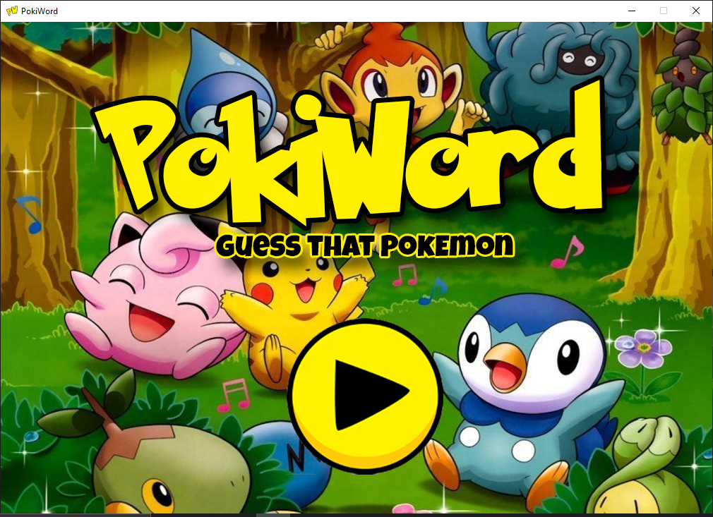
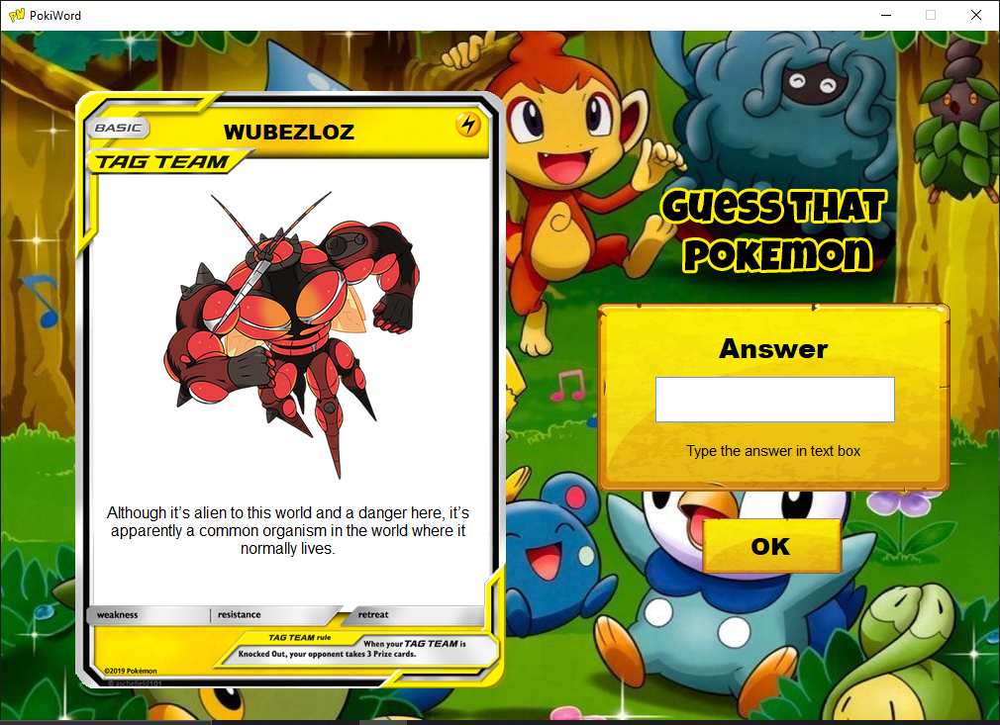
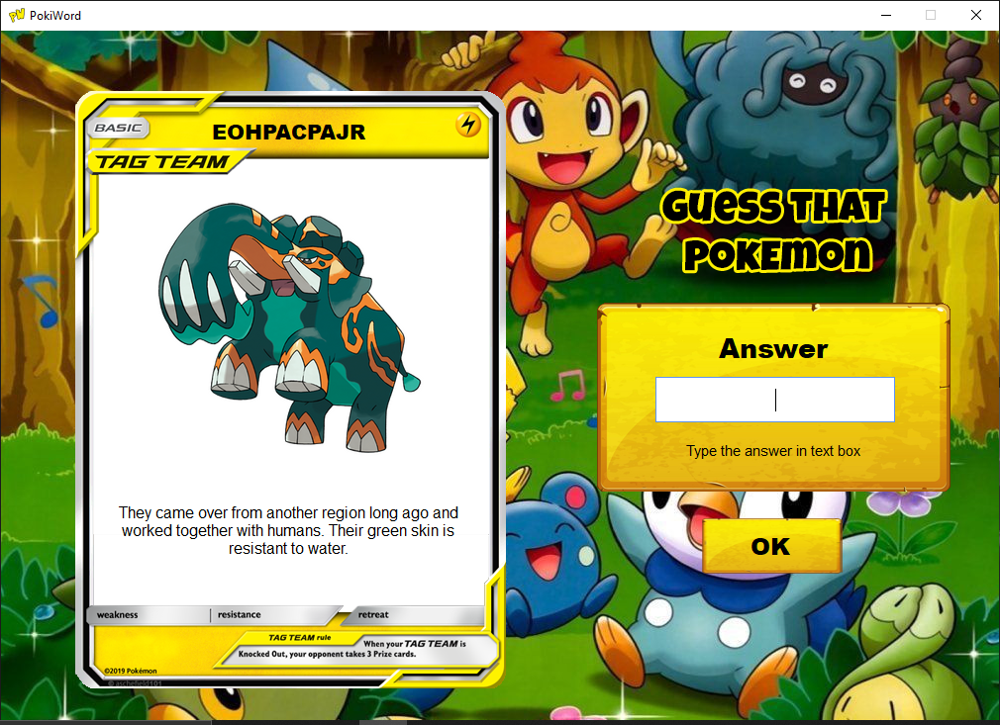
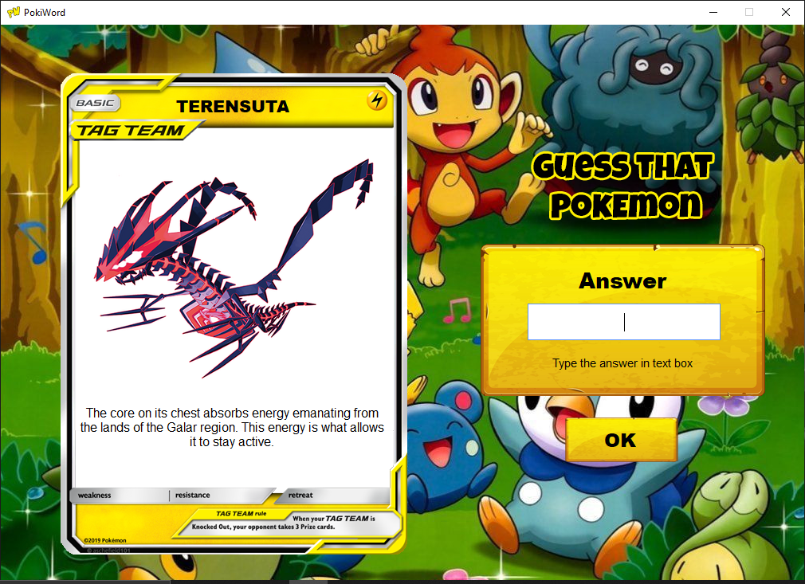
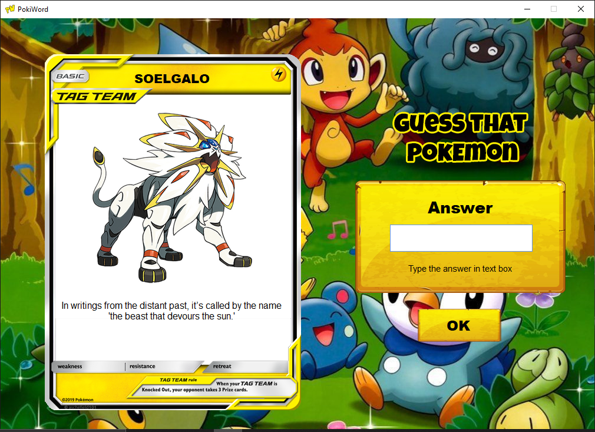
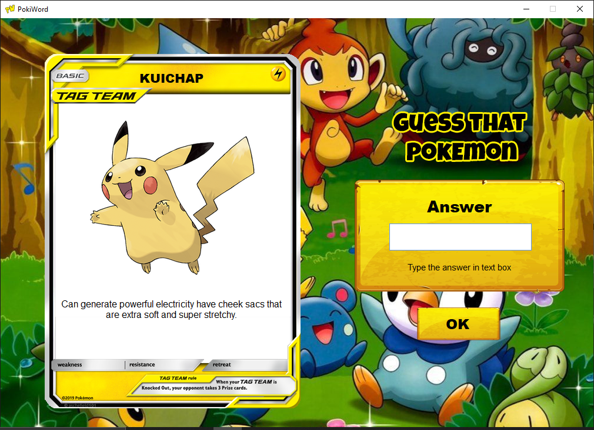

<h4 align=center>
	
	<br>
	A Task Performance in Integrative Programming intended to create a word-guessing game with Array and String Builder. I make it more fascinating by making references to Pokémon.
</h4>
	
## **Run the Program** 📜
 To run the program, the device must have:
 - .Net Framework (Used version 4.6.1)
 - IDE (Visual Studio)

## **How to Play** 📚
1. Click the Play button
2. Using the Hint found on the Card, try to guess the Pokemon's name. 
3. A Message Box will appear, indicating whether you were correct or not. 
4. Then you can either continue the game or not by clicking yes or no.

## **Application of Array and String Builder** ⚙️
### Array
I used an array to store the data of Pokemon. Each pokemon's name and description are related to one another by an index number.
```
string[] name = { "Buzzwole", "Copperajah", "Eternatus", "Solgaleo", "Volcanion", "Pikachu", "Raichu", "Bulbasaur", "Charmander", "Squirtle"};

string[] description = { 
    "Although it’s alien to this world and a danger here, it’s apparently a common organism in the world where it normally lives.", 
    "They came over from another region long ago and worked together with humans. Their green skin is resistant to water.", 
    "The core on its chest absorbs energy emanating from the lands of the Galar region. This energy is what allows it to stay active.", 
    "In writings from the distant past, it’s called by the name 'the beast that devours the sun.'", 
    "It lets out billows of steam and disappears into the dense fog. It’s said to live in mountains where humans do not tread.",
    "Can generate powerful electricity have cheek sacs that are extra soft and super stretchy.",
    "Its long tail serves as a ground to protect itself from its own high-voltage power.",
    "There is a plant seed on its back right from the day this Pokémon is born. The seed slowly grows larger.",
    "It has a preference for hot things. When it rains, steam is said to spout from the tip of its tail.",
    "When it retracts its long neck into its shell, it squirts out water with vigorous force."
};
```

### String Builder
I used String Builder to store data for a single randomly generated Pokemon.
```
 Pokemon pokemon = new Pokemon();

 string[] pokemon_data = pokemon.getRandomPokemon();
 StringBuilder name = new StringBuilder(pokemon_data[0]);
 StringBuilder image = new StringBuilder(pokemon_data[1]);
 StringBuilder desc = new StringBuilder(pokemon_data[2]);
```

## **Screen Shot** 📷
<p float="left">






</p>

## Game Resources 🎮
* Pokemon Data - [Pokedex](https://www.pokemon.com/us/pokedex/)
* Card - [ImgFlip](https://imgflip.com/memetemplate/232798955/Blank-pokemon-card)
* Background Image - [Desktop Background](https://www.desktopbackground.org/wallpaper/cute-and-funny-pokemon-wallpapers-48-280101)
* Background Music - Pokemon Omega Ruby & Alpha Sapphire OST Fortree City 
 
## **Contribution** 🔥
If you wish to help improve this project, fork this repo and submit your own pull request. If you discover a problem with this project, please report it to the issue page. Thank you very much   😊.

## **Thank you** 💖
If you like this project just click ⭐ and share it with others.


